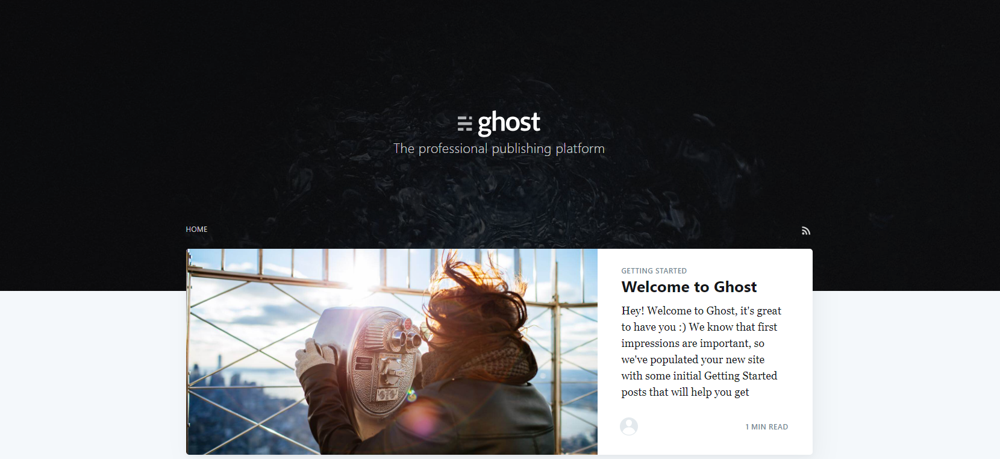
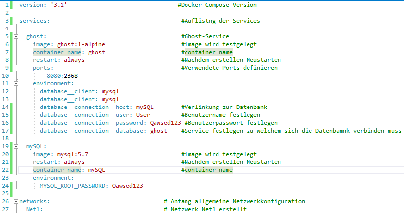
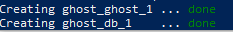

# **LB2** **Docker**  <!-- omit in toc -->

## Inhalt <!-- omit in toc -->
- [Einleitung](#einleitung)
- [Kapitel 1 Der Service](#kapitel-1-der-service)
- [Kapitel 2 Technische Angaben](#kapitel-2-technische-angaben)
  - [Netzwerkplan](#netzwerkplan)
  - [Code](#code)
  - [Anleitung für den Betrieb](#anleitung-f%C3%BCr-den-betrieb)
- [Kapitel 3 Testing](#kapitel-3-testing)
- [Quellen](#quellen)

# Einleitung

In der Lernberuteilung muss ich einen Service via Docker bereitstellen. Docker ist eine Open-Source Containervirtualisierungsplatfform. Mit Docker Hub können Images von Anwendungen oder Betriebssystemen heruntergeladen und verwended werden.

Diese LB habe ich nahcträglich und selbstständig erarbeitet.

# Kapitel 1 Der Service

Als Service wird **Ghost** realisiert. Im Hintergrund wird **MySQL** benutzt. Ghost ist eine Gratis-Blog-Lösung auf welcher man seine eigen Blogs ertsellen kann.  




# Kapitel 2 Technische Angaben

Der Service wird mit 2 Docker Container realisiert. Bei ersten wird MySQL, beim zweiten Ghost installiert. Durch das custom "Net1" Netzwerk können die Container kommunizieren.

| **Info**       | **Container** 1 |   **Container** 2 |
| :------------- | :-------------: | ----------------: |
| Container Name |      MySQL      |             Ghost |
| Docker Image   |    mysql:5.7    |    ghost:1-alpine |
| Netzwerk       |      Net1       |              Net1 |

## Netzwerkplan


Die Container werden innerhalb von der Docker VM aufgesetzt. Das Net1 wird auf den Modus "Bridge" konfiguriert, sodass die Container vom Host erreichbar sind. Dabei ist der Host auch der Gateway zum Internet.

Die zwei Container werden am Net1 angehängt und bekommen per DHCP eine IP im Range 127.0.0.x/24. Der Gateway erhält immer die IP 172.0.0.1.

Das Ghost-Programm, die mySQL-Software und dsa Betriebssystem werden zusammengefügt und im Ghostcore zusammengesetzt, das Ergebnis wird für den Benutzer sichtbar.

Damit der Host auf das Webinterface von Ghost zugreifen kann, muss der Container Port 80 auf den Host Port 8080 verknüpft werden.

## Code
Das Projekt wurde mit einem Docker Compose File realisiert. In diesem File werden alle Container und Netzwerk Parameter definiert. Mit diesem Befehl wird dann die Struktur aufgesetzt:
```Shell
docker-compose -f ʺPfad\zum\File\docker-compose.ymlʺ up -d --build
 ```
"-d" definiert, dass die Container im Hintergrund aufgesetzt wird.

"-f" setzt den den Pfad zum docker-compose.yml File

Hier der Code des docker-compose.yml File:



Auf Zeile 5-17 wird der Ghost Container erstellt und konfiguriert zudem auch ein Teil der Datenbank

Auf Zeile 19-24 wird der mySQL Container erstellt.

Auf der Zeile 26-27 wird das Netzwerk erstellt

Das File ist auf meinem GitHub LB2 [Repository][lb2git] abgelegt

## Anleitung für den Betrieb

### 1. Installation <!-- omit in toc -->
Wie oben beim Code erklärt wird per Befehel das Docker-Compose.yml ausgeführt und somit die Container aufgesetzt:
```Shell
docker-compose -f ʺPfad\zum\File\docker-compose.ymlʺ up -d --build
 ```
Wenn alles geklappt hat sieht es so aus:



 ### 2. Zugriff auf MySQL Webinterface <!-- omit in toc -->

- Um auf Ghost nun zuzugreifen, muss ein Browser geöffnet werden.

- Es wird die URL http://localhost:8080 oder http://127.0.0.1:8080 eigegeben

Nun sieht das Fenster so aus:


# Kapitel 3 Testing

Das Testing wir mit einem Testing Protokoll durchgeführt. Dabei wird er SOLL / IST Zustand Verglichen und erläutert wie getestet wurde.

| SOLL-Zustand                                                             |                                      IST-Zustand                                      |                                                                                                            Test |
| :----------------------------------------------------------------------- | :-----------------------------------------------------------------------------------: | --------------------------------------------------------------------------------------------------------------: |
| 2 Container wurden per Befehl installiert                                |                 Die 2 Container wurden erstellt und werden ausgeführt                 | In Powershell wurde der Befehl docker-compose -f "C:\myrep\my_M300\Docker\LB2\docker-compose.yml" up -d --build |
| Das Netzwerk "Net1" wurde erstellt                                       |             Das Netzwerk wurde während dem Ausführen des Befehls erstellt             |                                        Mit dem Befehl: Docker Network ls werden alle Docker Netzwerke angezeigt |
| Die Portverlinkung von Ghost von Port 80 auf 8080 ist gewährleistet      | Mit http://localhost:8080 kann auf das Webinterface von Ghost zugegriffen werden |                                                             Im Browser die Adresse http://localhost:8080 öffnen |


# Quellen

**Benutzte** **Images**:

ghost:1-alpine 

MySQL:5.7 [Docker Hub][sql]


**Benutzte** **Websites**:

Offizielle Ghost Website [Dokumentation][ght]

Mein allgemeines GitHub [Repository][mygit]

Mein LB 2 GitHub [Repository][lb2git]

Modul 300 [Repository][m300git]

Docker Compose [Dokumentation][dc]

<!-- Link Index -->

[ght]: https://docs.ghost.org/concepts/introduction/

[sql]: https://hub.docker.com/_/mysql

[mygit]: https://github.com/nicola-leuthold/M300-Services/

[lb2git]: https://github.com/nicola-leuthold/M300-Services/tree/master/LB2

[m300git]: https://github.com/mc-b/M300

[dc]: https://docs.docker.com/compose/
